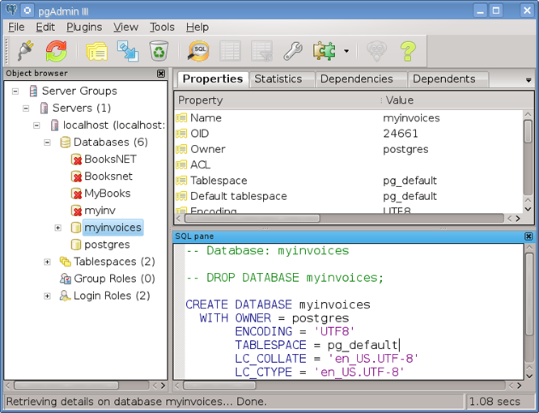
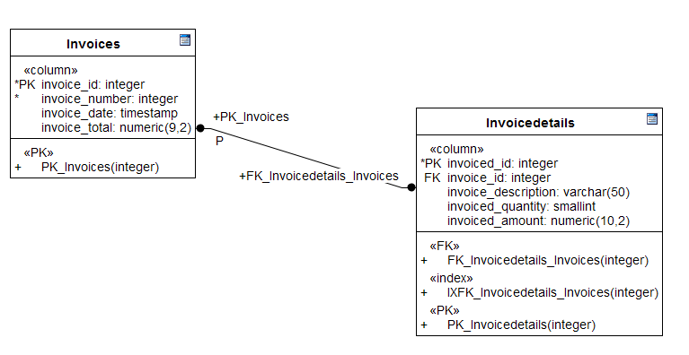
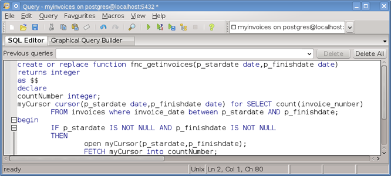
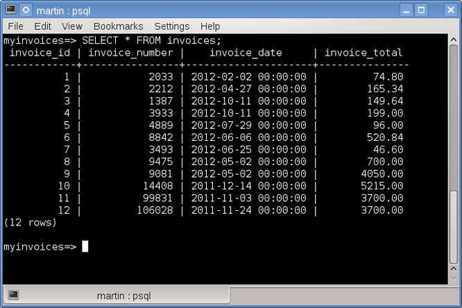
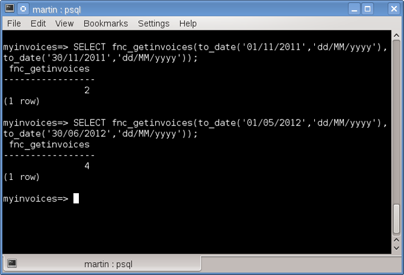

# Cursores  (Cursors) y Funciones (Functions) PLpg/SQL en PostgreSQL

Un cursor es el nombre que recibe un apuntador (pointer) de solo lectura hacia un conjunto de datos ( resultset) que se obtiene de una consulta SQL asociada, para los cursores pensemos en términos de arreglos similar a los arreglos de un lenguaje de programación, los cursores nos sirven para procesar una a una las filas que componen un conjunto de resultados en vez de trabajar con todos los registros como en una consulta tradicional de SQL.

Los cursores pueden declararse con una consulta SQL sin parámetros o con parámetros, en donde el tamaño del conjunto de datos depende del valor de los parámetros de la consulta.  Así por ejemplo declaramos:

<pre>
/*Cursor without parameters*/
 v_cursor CURSOR FOR 
SELECT invoice_id, invoice_number,invoice_date,invoice_total 
FROM invoices;
</pre>

<pre>
/*Cursor with parameters*/
 v_cursor CURSOR (p_number numeric) IS 
SELECT  invoice_id, invoice_number,invoice_date, invoice_total 
FROM invoices WHERE invoice_number = p_number;
</pre>

Los cursores pueden emplearse dentro de funciones PL/SQL para que las aplicaciones que accedan a PostgreSQL puedan utilizarlos más de una vez.

Como ejemplo tenemos una base de datos llamada <b>myinvoices</b>,

 
que contiene las siguientes tablas:

<b>invoices</b>

<b>invoicedetails</b>

 

Ahora como ejemplo de un <b>cursor</b> utilizado dentro de una función, declaramos una función utilizando un <b>cursor con parámetros</b> para devolver el total de facturas emitidas dentro de un rango de fechas.

 

Existen dos errores comunes cuando trabajamos con cursores: 
<ol>
<li>Si tratas de abrir un cursor que ya se encuentra abierto PostgreSQL enviará un mensaje de <b>“cursor [name] already in use”</b></li>
<li>Si tratas de ejecutar <b>FETCH</b> en un cursor que no ha sido abierto, <b>PostgreSQL</b> enviará un mensaje de <b>“cursor [name] is invalid”</b></li>
</ol>

Cuando utilizamos el comando FETCH obtenemos una por una las filas del conjunto de resultados  después de cada fila procesada el cursor avanza a la siguiente fila y la fila procesada puede ser entonces utilizada dentro de una variable.

Consultamos los datos de la tabla <b>invoices</b>
 

 

Ejecutamos la función, usando los siguientes argumentos:

<pre>
/*Execute the function*/
select fnc_getinvoices(to_date('01/05/2012','dd/MM/yyyy'),to_date('30/06/2012','dd/MM/yyyy'));
</pre>

Obtenemos los siguientes resultados: 
 

